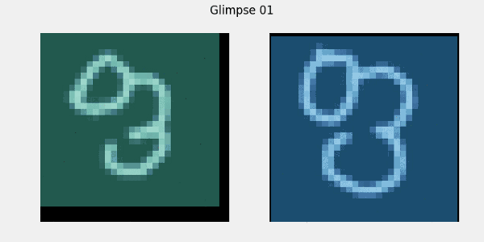
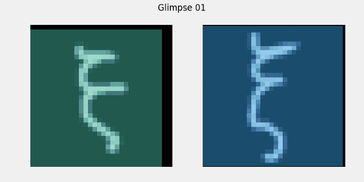
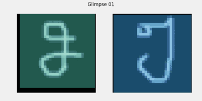
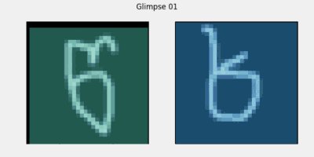

# arc-pytorch
PyTorch implementation of [Attentive Recurrent Comparators](https://arxiv.org/abs/1703.00767) by Shyam et al.

A [blog](https://medium.com/@sanyamagarwal/understanding-attentive-recurrent-comparators-ea1b741da5c3) explaining Attentive Recurrent Comparators

### Visualizing Attention

#### On Same characters
 

#### On Different Characters
 


### How to run?

#### Download data
```
python download_data.py
```
A one-time 52MB download. Shouldn't take more than a few minutes.

#### Train
```
python train.py --cuda
```
Let it train until the accuracy rises to at least 80%

#### Visualize
```
python viz.py --cuda --load 0.13591022789478302 --same
```
Run with exactly the same parameters as train.py and specify the model to load. Specify "--same" if you want to generate a sample with same characters in both images.
